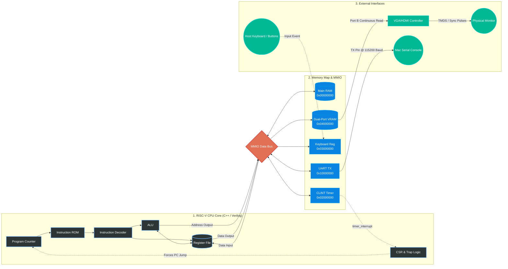

# Anvil-V — A RISC-V Digital Twin 

**A hardware/software co-designed RISC-V system**: a cycle-accurate C++ instruction-set simulator with an SDL2-based graphical "digital twin," paired with a from-scratch Verilog CPU core that runs the exact same compiled firmware on real FPGA silicon.

The two implementations share one goal — prove out a RISC-V system in fast software simulation, then validate that the same binary produces identical behavior on physical hardware with real VGA/HDMI output, a hardware UART, and interrupt-driven I/O.

---

## Table of Contents
- [Overview](#overview)
- [System Architecture](#system-architecture)
- [Key Features](#key-features)
- [Repository Structure](#repository-structure)
- [Getting Started](#getting-started)
  - [1. Software Emulator (C++ / SDL2)](#1-software-emulator-c--sdl2)
  - [2. FPGA Core (Verilog)](#2-fpga-core-verilog)
- [The Firmware: A Preemptive Multitasking RTOS](#the-firmware-a-preemptive-multitasking-rtos)
- [Technical Highlights](#technical-highlights)

---

## Overview

Anvil-V is split into two independent but binary-compatible implementations of a RISC-V (RV32IMA + Zicsr) processor:

| | **Software Twin** (`/OS`) | **Hardware Core** (`/FPGA`) |
|---|---|---|
| **Implementation** | C++17 instruction-set simulator | Verilog RTL, synthesized to a Gowin FPGA |
| **Output** | SDL2 window (framebuffer + input) | Native VGA timing → HDMI (via TMDS/DVI encoder) |
| **Purpose** | Fast iteration, debugging, RTOS development | Cycle-accurate hardware validation |
| **Runs** | The identical compiled `firmware.bin` | The identical compiled `firmware.bin` |

Because both cores implement the same ISA and the same memory map, firmware written once — including a hand-rolled preemptive scheduler — runs unmodified on both the simulator and the physical FPGA board. This "digital twin" workflow mirrors how real silicon and embedded systems teams validate designs long before physical hardware is available.

## System Architecture



## Key Features

- **Custom RV32IMA + Zicsr core**, implemented twice from first principles — once in C++ as a fetch/decode/execute simulator, once in synthesizable Verilog as a single-cycle pipeline.
- **Machine-mode trap and interrupt infrastructure**: a CSR file (`mstatus`, `mtvec`, `mepc`, `mcause`, `mtval`), a hardware CLINT-style timer, and full `ecall` / `ebreak` / `mret` support — the exact primitives a real OS kernel needs.
- **A real preemptive multitasking RTOS**, written in C and hand-written RISC-V assembly, with timer-interrupt-driven context switching between independent tasks sharing one CPU.
- **Memory-mapped I/O peripheral bus**: RAM, dual-port VRAM (framebuffer), a keyboard input register, and a UART transmitter, all address-decoded off a shared bus in both implementations.
- **Native video output pipeline on hardware**: a VGA timing generator drives a dual-port VRAM, which feeds a DVI/TMDS encoder producing a real HDMI signal directly from the FPGA — no external graphics chip.
- **Toolchain-complete build flow**: a `riscv64-elf-gcc` freestanding cross-compilation pipeline (custom linker script + startup code) produces a flat binary consumed identically by the simulator and the FPGA's instruction ROM.

## Repository Structure

## Repository Structure

```
riscv-digital-twin/
├── OS/                       # Software "digital twin" — C++ ISA simulator
│   ├── src/
│   │   ├── cpu.cpp / cpu.h       # Fetch-decode-execute core, CSR file, trap handling
│   │   ├── memory.cpp / memory.h # Byte-addressable RAM, VRAM, MMIO read/write
│   │   └── main.cpp              # SDL2 event loop, framebuffer rendering, keyboard input
│   ├── test_firmware/
│   │   ├── main.c                # RTOS: task scheduler + two concurrent demo tasks
│   │   ├── trap.s                # Hand-written context-switch / trap vector
│   │   ├── crt0.s, linker.ld     # Startup code and memory layout for bare-metal firmware
│   ├── CMakeLists.txt
│   └── build.sh                  # Cross-compiles firmware, then builds the emulator
│
└── FPGA/                     # Hardware core — synthesizable Verilog
    ├── src/
    │   ├── cpu_top.v              # Top-level core: fetch/decode/execute + MMIO routing
    │   ├── alu.v, control_unit.v, register_file.v, pc.v
    │   ├── csr_file.v             # CSR bank + trap/interrupt entry logic
    │   ├── clint.v                # Hardware timer & interrupt generation
    │   ├── uart_tx.v, vram.v, vga_controller/
    │   └── instr_mem.v, data_mem.v
    ├── sim/cpu_tb.v               # Verilog testbench (iverilog/GTKWave)
    └── constraint.cst             # Physical pin constraints for the target Gowin FPGA
```

## Getting Started

### 1. Software Emulator (C++ / SDL2)

**Prerequisites:** CMake ≥ 3.10, a C++17 compiler, SDL2, and a `riscv64-elf-gcc` cross-compiler toolchain (for rebuilding firmware).

```bash
cd OS
./build.sh          # Cross-compiles test_firmware/*.c/.s -> firmware.bin, then builds the emulator
./build/anvil_emu    # Launches the SDL2 window running the RTOS
```

Controls: **W / A / S / D** move the on-screen sprite, driven by one of the two concurrently scheduled RTOS tasks.

### 2. FPGA Core (Verilog)

**Simulation (no hardware required):**

```bash
cd FPGA
iverilog -o cpu_sim sim/cpu_tb.v src/*.v
vvp cpu_sim
gtkwave cpu_sim.vcd   # Inspect waveforms
```

**Synthesis (Gowin toolchain):**
The core targets a Gowin FPGA (pin mapping in `constraint.cst` is configured for a Sipeed Tang Nano–class board with a 27 MHz input clock and HDMI output). Open the project in Gowin EDA, set `cpu_top.v` as the top module, and run Synthesize → Place & Route → Program Device.

## The Firmware: A Preemptive Multitasking RTOS

The most technically dense part of this project is `test_firmware/main.c` + `trap.s`, which implements a small but *real* preemptive kernel on top of the bare RV32I trap mechanism:

1. **Two independent tasks** — an interactive game loop reading keyboard MMIO and drawing to VRAM, and a background "heartbeat" task streaming status text over UART — each with its own stack.
2. **A hardware timer interrupt** (via the CLINT's `mtime`/`mtimecmp` registers) fires on a fixed interval, trapping into `os_trap_vector`.
3. **`trap.s` saves the full register file** to the interrupted task's stack, calls the C scheduler (`os_scheduler`) to pick the next task, restores that task's register file, and `mret`s back into it — a textbook software context switch built entirely from `mstatus`/`mepc`/`mcause` primitives.

This is the same mechanism (timer interrupt → trap → save context → schedule → restore context → return) used by production RTOSes and general-purpose kernels, implemented here from the ISA up.

## Technical Highlights

- **Instruction set:** RV32I base integer ISA, the M extension (`MUL`/`DIV`/`REM` and unsigned variants), the A extension (atomic `AMO*` operations), and Zicsr (CSR read/modify/write instructions) — implemented in both C++ and Verilog.
- **Immediate decoding:** full I/S/B-type immediate extraction and sign-extension logic, mirrored between the two implementations.
- **Interrupt-driven video:** the VGA controller drives pixel timing off a dedicated 27 MHz pixel clock generated by an on-chip PLL, decoupled from the CPU's execution clock, while a dual-port VRAM lets the CPU write pixels and the display read them simultaneously with no contention.
- **Address-decoded MMIO:** a single load/store path is shared by RAM, the CLINT, the VRAM framebuffer, a keyboard register, and a UART transmitter, gated purely by combinational address decoding — no separate I/O instruction space.
